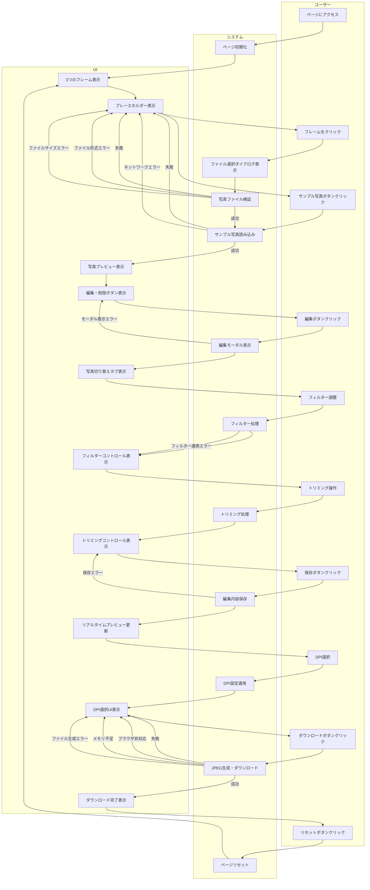
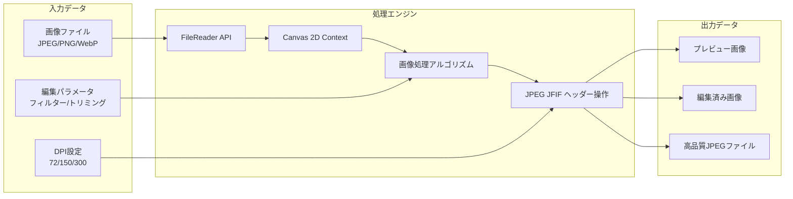
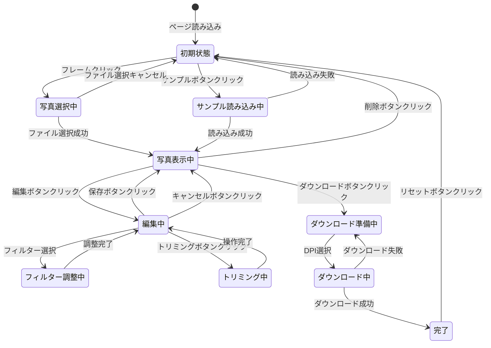
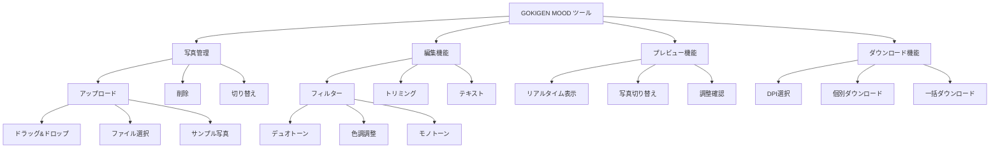
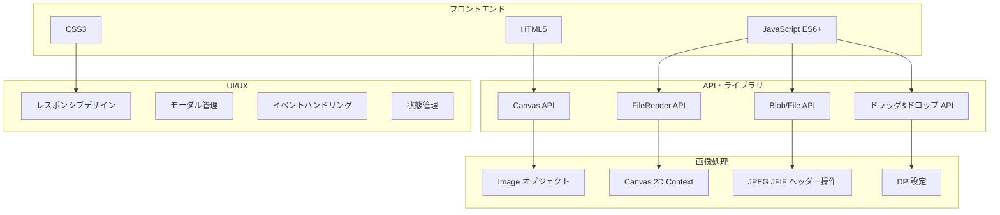

# GOKIGEN MOOD ユーザー体験フロー図

## メインフロー図



## データフロー図



## 状態遷移図



## UI 構造図

```mermaid
graph TB
    subgraph "ヘッダーセクション"
        H1[GOKIGEN MOOD タイトル]
        H2[DPI選択セレクトボックス]
    end

    subgraph "メインエリア"
        M1[写真フレーム1 - A4版<br/>210×297mm]
        M2[写真フレーム2 - L版<br/>89×127mm]
        M3[写真フレーム3 - L版<br/>127×89mm]
        M4[サンプル写真ボタン]
        M5[リセットボタン]
    end

    subgraph "編集モーダル"
        E1[写真プレビューエリア]
        E2[写真切り替えタブ<br/>写真1 | 写真2 | 写真3]
        E3[左右矢印ボタン<br/>← | →]
        E4[フィルターコントロール<br/>デュオトーン・色調調整]
        E5[トリミングコントロール<br/>ドラッグ・ズーム]
        E6[保存・キャンセルボタン]
    end

    subgraph "ダウンロードセクション"
        D1[個別ダウンロードボタン]
        D2[一括ダウンロードボタン]
    end

    H1 --> M1
    H2 --> M1
    M1 --> M2
    M2 --> M3
    M3 --> M4
    M4 --> M5
    M1 --> E1
    E1 --> E2
    E2 --> E3
    E3 --> E4
    E4 --> E5
    E5 --> E6
    E6 --> D1
    D1 --> D2
```

## 機能マップ



## 技術構成図


